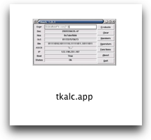

#Tkalc 1.0.2
by boris@folgmann.de <http://www.folgmann.de/en/software/tkalc/>  
Packaged by Pedro Parracho <pedro.parracho@gmail.com> as MacOS application.

## Description:
Tkalc <http://www.folgmann.de/en/software/tkalc/> packaged as MacOS apllication.  
I'm bringing this great application to easier launch in MacOS.
 
## Install
Copy the folder `tkalc.app` to the `Application` folder.

## Feature
tkalc will look like a native application.

##Screenshot

## License
First public release.